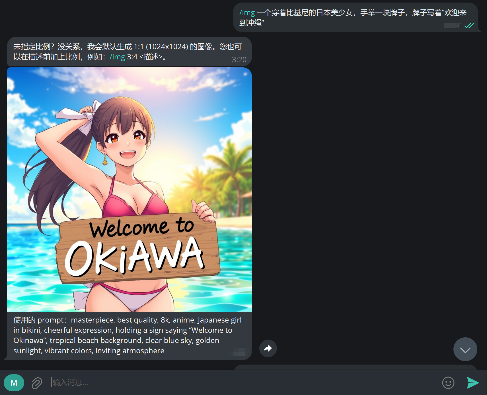

<h1 align="center">
Flux-Telegram-Workers
</h1>

      English | <a href="README_CN.md">中文</a>

    <em>Deploy your own Telegram Flux bot on Cloudflare Workers with ease.</em>

## About

The simplest and quickest way to deploy your own FLUX Telegram bot. Using Cloudflare Workers, it’s as easy as copying and pasting a single file—no dependencies, no need to set up a local development environment, no domain, and no server required.

View Demo

## Bot Workflow
Runs on Cloudflare Workers, calls a specified OpenAI API-compatible model to optimize prompts, and uses Silicon Flow's API to generate images. The optimized prompt is displayed below the generated image.

## Documentation

- [Deploy on Cloudflare Workers](./doc/en/DEPLOY.md)

## License

**FLUX-Telegram-Workers** is released under the MIT License. [See LICENSE](LICENSE) for details.
